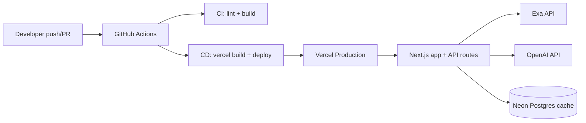

# Deployment Guide

Deploy AI Radar to Vercel with GitHub Actions CI/CD.

## Architecture



## Prerequisites

- GitHub repo: `CharmTzy/Sup-Build-Hackathon`
- Vercel account (free tier is enough for the hackathon demo)
- Optional API keys for live data: Exa, OpenAI, Neon `DATABASE_URL`

## Option A — Vercel dashboard import (fastest first deploy)

1. Open [vercel.com/new](https://vercel.com/new) and import the GitHub repository.
2. Framework preset: **Next.js** (auto-detected).
3. Add environment variables for **Production**:
   | Variable | Required | Notes |
   | --- | --- | --- |
   | `EXA_API_KEY` | No | Live news/search; mock data without it |
   | `OPENAI_API_KEY` | No | Structured cards + Ask Radar |
   | `OPENAI_MODEL` | No | e.g. `gpt-5.5` |
   | `DATABASE_URL` | No | Neon connection string for Radar cache |
4. Deploy once from the dashboard to confirm the project builds.
5. Complete **Option B** below so GitHub Actions owns production deploys.

## Option B — GitHub Actions deploy (CI/CD)

### 1. Link the local repo to Vercel

```bash
npm install
npx vercel login
npx vercel link
```

After linking, read IDs from `.vercel/project.json`:

```bash
cat .vercel/project.json
```

Copy `orgId` and `projectId`.

### 2. GitHub Actions secrets

In GitHub → **Settings → Secrets and variables → Actions**, add:

| Secret | Value |
| --- | --- |
| `VERCEL_TOKEN` | [Vercel account token](https://vercel.com/account/tokens) |
| `VERCEL_ORG_ID` | `orgId` from `.vercel/project.json` |
| `VERCEL_PROJECT_ID` | `projectId` from `.vercel/project.json` |

Optional (CI only — production values should live in Vercel):

| Secret | Purpose |
| --- | --- |
| `EXA_API_KEY` | CI build/test with live integrations |
| `OPENAI_API_KEY` | CI build/test with live integrations |
| `DATABASE_URL` | CI build/test with Neon |

### 3. Vercel production environment variables

In Vercel → Project → **Settings → Environment Variables**, set the same
runtime keys as local `.env.local` (`EXA_API_KEY`, `OPENAI_API_KEY`, etc.).

Do **not** prefix server secrets with `NEXT_PUBLIC_`.

### 4. Push and verify

```bash
git add .
git commit -m "Add Vercel CI/CD"
git push origin main
```

- **CI** runs on every push and pull request to `main`.
- **Deploy** runs on every push to `main` after secrets are configured.
- Until `VERCEL_TOKEN`, `VERCEL_ORG_ID`, and `VERCEL_PROJECT_ID` exist, the
  deploy workflow completes with a skipped-deployment summary instead of failing.

Check **Actions** in GitHub for workflow status. A successful deploy prints the
production URL in the job summary.

## Health check after deploy

```bash
curl https://YOUR-PROJECT.vercel.app/api/health
```

Expect JSON describing database, Exa, and OpenAI configuration status.

## Troubleshooting

| Symptom | Likely fix |
| --- | --- |
| Deploy workflow skipped or fails on secrets | Add `VERCEL_TOKEN`, `VERCEL_ORG_ID`, `VERCEL_PROJECT_ID` |
| App shows mock data only | Add `EXA_API_KEY` and `OPENAI_API_KEY` in Vercel env vars, redeploy |
| Exa 401 in `/api/health` | Regenerate key, remove trailing spaces, redeploy |
| Database unavailable | Set Neon `DATABASE_URL` in Vercel; run `npm run db:init` once against that DB |
| CI build fails on lint | Run `npm run lint` locally and fix reported issues |

## Files added for deployment

- `vercel.json` — framework and install/build commands
- `.github/workflows/ci.yml` — lint + build gate
- `.github/workflows/deploy.yml` — production deploy via Vercel CLI
